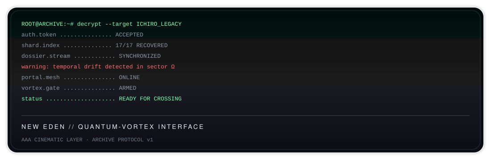
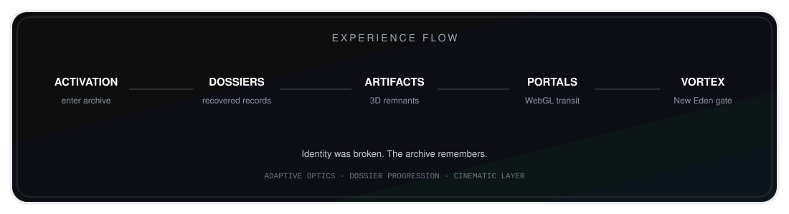
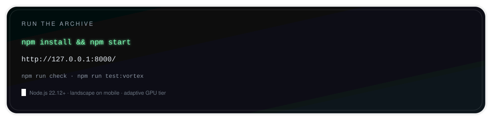

<!-- ICHIRO — Legacy of Rebirth -->
<div align="center">
  
</div>

<br/>

<div align="center">
  
</div>

---

### The recovery begins

Ichiro’s path was never a straight line.  
Fragments remained — dossiers, artifacts, signals — scattered across what was left behind.

**Legacy of Rebirth** is the archive that brings them back into one place:  
an interactive cinematic experience where memory, identity, and crossing converge.

This is not a trailer.  
It is something you enter.

---

### What it is

**ICHIRO — Legacy of Rebirth** is a cinematic interactive archive experience.

It combines:

- narrative interfaces  
- WebGL portals  
- 3D recovered artifacts  
- adaptive audio  
- dossier progression  
- the New Eden quantum-vortex crossing  

Built as a self-contained experience under **Ethernium**.

---

### Experience flow

<div align="center">
  
</div>

| Stage | What you encounter |
|-------|--------------------|
| **Activation** | Entry into the archive |
| **Dossiers** | Recovered records and narrative fragments |
| **Artifacts** | 3D objects pulled back from the scatter |
| **Portals** | WebGL transitions through the archive |
| **Vortex** | The crossing toward New Eden |

The archive adapts: higher-end devices run fuller optics; lighter devices keep the choreography with reduced density.

---

### Run the archive

<div align="center">
  
</div>

**Requirements**
- Node.js **22.12+**

```bash
npm install
npm start
```

Open `http://127.0.0.1:8000/`.

## Production assets

The runtime defaults to production-safe derivatives:

- 120 FPS H.264 portal transition with progressive download metadata.
- Quantized YATAGARASU blueprint preserving the approved silhouette.
- Budget archive cinematic retaining its original timing.
- Adaptive GPU and optical quality based on measured frame cadence.

Large source masters are retained through Git LFS for preservation. They are not
used by the default production path.

## Quality profiles

The experience selects an adaptive visual tier. Capable displays can run at
120 FPS; slower devices retain the same choreography while reducing secondary
optics and particle density. Mobile presentation requires landscape orientation
to preserve the authored panoramic platform.

## Validation

```bash
npm test
npm run test:assets
npm run test:runtime
npm run test:visual
npm run test:dossiers
npm run test:e2e
```

The canonical gate validates repository integrity, production readiness, VEIL,
entry, transmission, and cinematic-cohesion contracts. See
[Repository Integrity v251](docs/REPOSITORY_INTEGRITY_v251.md) for the public
source-of-truth rules.

The browser proof runs the complete Chromium golden path and stores named
screenshots plus a machine-readable console/network report under
`.artifacts/e2e`.

The asset-governance gate separates studio masters from web derivatives,
enforces byte budgets for every runtime phase, and stores its report under
`.artifacts/assets`. See [Asset Governance v253](docs/ASSET_GOVERNANCE_v253.md).

The runtime-ownership gate verifies one authority for phase-owned controllers,
hidden-tab suspension, KPCO cleanup, and scheduled-work inventory. Its report is
stored under `.artifacts/runtime`. See
[Runtime Ownership v254](docs/RUNTIME_OWNERSHIP_v254.md).

The visual-cohesion gate freezes CSS complexity ceilings, stylesheet order,
semantic optical tokens, and the primary silhouettes that effects must not
obscure. Its report is stored under `.artifacts/visual`.

The dossier-contract gate exercises all eleven deterministic validators and the
complete unlock graph. See
[Dossier Contracts v256](docs/DOSSIER_CONTRACTS_v256.md).

## Production roadmap

See the [KPR Omega Master Plan v251+](docs/OMEGA_MASTER_PLAN_v251_PLUS.md) for
the phased route from the v250 baseline to the production, accessibility,
deployment, dossier, and award-submission definition of done.

The implementation sequence from optical governance through Gold is defined in
the [Mega Omega Master Plan v255-v260](docs/MEGA_OMEGA_MASTER_PLAN_v255_v260.md).

## Rights

Code and original creative assets are publicly viewable but remain protected.
See [LICENSE.md](LICENSE.md).
