<!-- ICHIRO — Legacy of Rebirth -->
<div align="center">
  
</div>

<br/>

<div align="center">
  
</div>

---

### The recovery begins

Ichiro’s path was never a straight line.  
Fragments remained — dossiers, artifacts, signals — scattered across what was left behind.

**Legacy of Rebirth** is the archive that brings them back into one place:  
an interactive cinematic experience where memory, identity, and crossing converge.

This is not a trailer.  
It is something you enter.

---

### What it is

**ICHIRO — Legacy of Rebirth** is a cinematic interactive archive experience.

It combines:

- narrative interfaces  
- WebGL portals  
- 3D recovered artifacts  
- adaptive audio  
- dossier progression  
- the New Eden quantum-vortex crossing  

Built as a self-contained experience under **Ethernium**.

<div align="center">
  
  
  
  
</div>

---

### Experience flow

<div align="center">
  
</div>

| Stage | What you encounter |
|-------|--------------------|
| **Activation** | Entry into the archive |
| **Dossiers** | Recovered records and narrative fragments |
| **Artifacts** | 3D objects pulled back from the scatter |
| **Portals** | WebGL transitions through the archive |
| **Vortex** | The crossing toward New Eden |

The archive adapts: higher-end devices run fuller optics; lighter devices keep the choreography with reduced density.

### Sovereign engine profile

<div align="center">
  
</div>

<div align="center">
  
  
  
  
  
  
</div>

The production runtime is self-contained: presentation assets use local font
fallbacks and the interactive experience does not require a runtime CDN.

---

### Run the archive

<div align="center">
  
</div>

**Live production archive**

[Enter ICHIRO - Legacy of Rebirth](https://steveblackbeard.github.io/ICHIRO-LegacyOfRebirth-by-Ethernium/)

<div align="center">
  <a href="https://steveblackbeard.github.io/ICHIRO-LegacyOfRebirth-by-Ethernium/">
    
  </a>
</div>

**Requirements**
- Node.js **22.12+**

```bash
npm install
npm start
```

Open `http://127.0.0.1:8000/`.

## Production assets

<div align="center">
  
</div>

The runtime defaults to production-safe derivatives:

- 120 FPS H.264 portal transition with progressive download metadata.
- Quantized YATAGARASU blueprint preserving the approved silhouette.
- Budget archive cinematic retaining its original timing.
- Adaptive GPU and optical quality based on measured frame cadence.

Large source masters are retained through Git LFS for preservation. They are not
used by the default production path.

## Quality profiles

The experience selects an adaptive visual tier. Capable displays can run at
120 FPS; slower devices retain the same choreography while reducing secondary
optics and particle density. Mobile presentation requires landscape orientation
to preserve the authored panoramic platform.

## Validation

```bash
npm test
npm run test:assets
npm run test:content
npm run test:runtime
npm run test:visual
npm run test:dossiers
npm run test:a11y
npm run test:delivery
npm run test:observability
npm run test:gold
npm run test:e2e
npm run test:e2e:matrix
npm run test:recovery
```

The canonical gate validates repository integrity, production readiness, VEIL,
entry, transmission, and cinematic-cohesion contracts. See
[Repository Integrity v251](docs/REPOSITORY_INTEGRITY_v251.md) for the public
source-of-truth rules.

The browser proof runs the complete Chromium golden path and stores named
screenshots plus a machine-readable console/network report under
`.artifacts/e2e`.

The browser/device matrix repeats the complete Gold journey in installed Chrome
and Edge and verifies reduced-motion, mobile and DPR 2 touch contracts. See
[Browser And Device Matrix v263](docs/BROWSER_DEVICE_MATRIX_v263.md).

The non-visual production and portability boundary is recorded in
[Production readiness](docs/PRODUCTION_READINESS.md).

The asset-governance gate separates studio masters from web derivatives,
enforces byte budgets for every runtime phase, and stores its report under
`.artifacts/assets`. See [Asset Governance v253](docs/ASSET_GOVERNANCE_v253.md).

The final-asset readiness gate maps every dossier and publication slot, checks
approved paths, hashes, budgets, provenance and fallbacks, and exposes a strict
zero-pending release gate. See
[Final Asset Ledger v264](docs/FINAL_ASSET_LEDGER_v264.md),
[Final Asset Contract v265](docs/FINAL_ASSET_CONTRACT_v265.md), and
[Frugal Asset Pipeline v266](docs/FRUGAL_ASSET_PIPELINE_v266.md).

The authored-media production status, master-library placement and v267
continuity record are documented in
[Final Asset Ledger v267](docs/FINAL_ASSET_LEDGER_v267.md),
[Final Asset Production Master Plan v267](docs/FINAL_ASSET_PRODUCTION_MASTER_PLAN_v267.md),
and [Continuity v267](docs/CONTINUITY_v267.md).

The safe integration of the sovereign presentation lineage with the complete
governed runtime is recorded in [Continuity v268](docs/CONTINUITY_v268.md).

The runtime-ownership gate verifies one authority for phase-owned controllers,
hidden-tab suspension, KPCO cleanup, and scheduled-work inventory. Its report is
stored under `.artifacts/runtime`. See
[Runtime Ownership v254](docs/RUNTIME_OWNERSHIP_v254.md).

The visual-cohesion gate freezes CSS complexity ceilings, stylesheet order,
semantic optical tokens, and the primary silhouettes that effects must not
obscure. Its report is stored under `.artifacts/visual`.

The dossier-contract gate exercises all eleven deterministic validators and the
complete unlock graph. See
[Dossier Contracts v256](docs/DOSSIER_CONTRACTS_v256.md).

The accessibility-contract gate protects dialog focus, keyboard containment,
focus return, lore-tab semantics, accessible control names, image alternatives,
and the absence of positive `tabindex`. See
[Accessibility Contract v257](docs/ACCESSIBILITY_CONTRACT_v257.md).

The secure-delivery gate starts the real server and verifies CSP, defensive
headers, MIME, byte ranges, cache revalidation and traversal rejection. It also
audits the pinned lockfile and emits a deterministic SHA-256 release manifest.
See [Secure Delivery v258](docs/SECURE_DELIVERY_v258.md).

The local-observability gate protects a bounded, memory-only health envelope
covering phase, quality, asset failures, WebGL context and long tasks. Reports
are downloaded only by an explicit local action; no telemetry endpoint exists.
See [Local Observability v259](docs/LOCAL_OBSERVABILITY_v259.md).

The Gold-candidate gate verifies the full v250-v259 ancestry, release documents,
cache identity and deterministic delivery fingerprint before review. See
[Gold Release Candidate v260](docs/GOLD_RELEASE_CANDIDATE_v260.md).

## Production roadmap

See the [KPR Omega Master Plan v251+](docs/OMEGA_MASTER_PLAN_v251_PLUS.md) for
the phased route from the v250 baseline to the production, accessibility,
deployment, dossier, and award-submission definition of done.

The implementation sequence from optical governance through Gold is defined in
the [Mega Omega Master Plan v255-v260](docs/MEGA_OMEGA_MASTER_PLAN_v255_v260.md).

## Rights

Code and original creative assets are publicly viewable but remain protected.
See [LICENSE.md](LICENSE.md).
