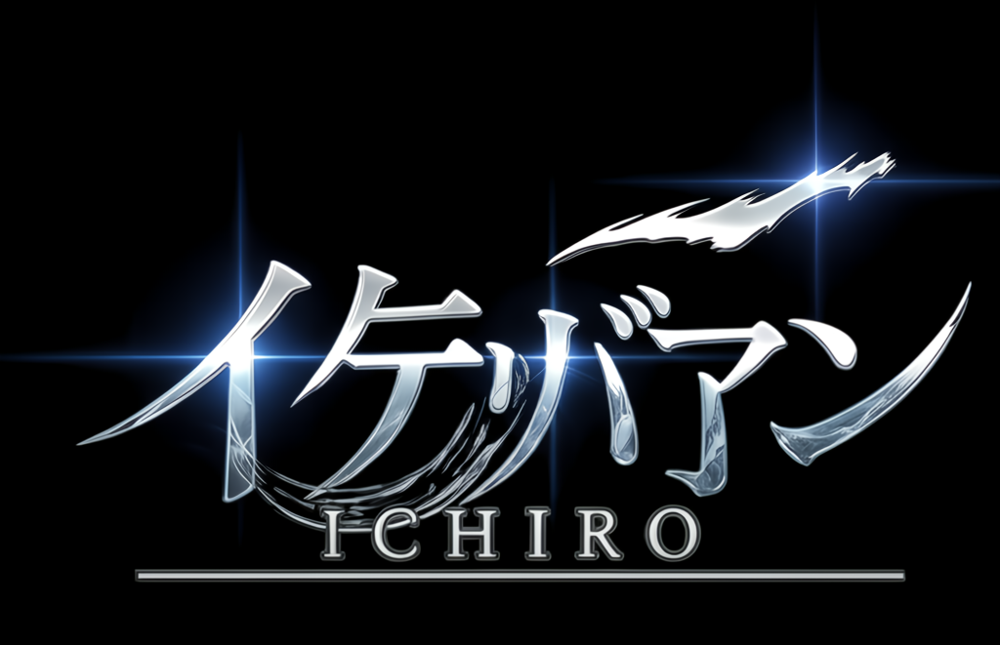

<!-- ICHIRO — Legacy of Rebirth -->
<div align="center">
  
</div>

<br/>

<div align="center">
  
</div>

<br/>

<div align="center">
  
</div>

---

### The recovery begins

Ichiro’s path was never a straight line.  
Fragments remained — dossiers, artifacts, signals — scattered across what was left behind.

**Legacy of Rebirth** is the archive that brings them back into one place:  
an interactive cinematic experience where memory, identity, and crossing converge.

This is not a trailer.  
It is something you enter.

---

### What it is

**ICHIRO — Legacy of Rebirth** is a cinematic interactive archive experience.

It combines:

- narrative interfaces  
- WebGL portals  
- 3D recovered artifacts  
- adaptive audio  
- dossier progression  
- the New Eden quantum-vortex crossing  

Built as a self-contained experience under **Ethernium**.

---

### Experience flow

<div align="center">
  
</div>

| Stage | What you encounter |
|-------|--------------------|
| **Activation** | Entry into the archive |
| **Dossiers** | Recovered records and narrative fragments |
| **Artifacts** | 3D objects pulled back from the scatter |
| **Portals** | WebGL transitions through the archive |
| **Vortex** | The crossing toward New Eden |

The archive adapts: higher-end devices run fuller optics; lighter devices keep the choreography with reduced density.

---

### Run the archive

<div align="center">
  
</div>

**Requirements**
- Node.js **22.12+**

```bash
npm install
npm start
